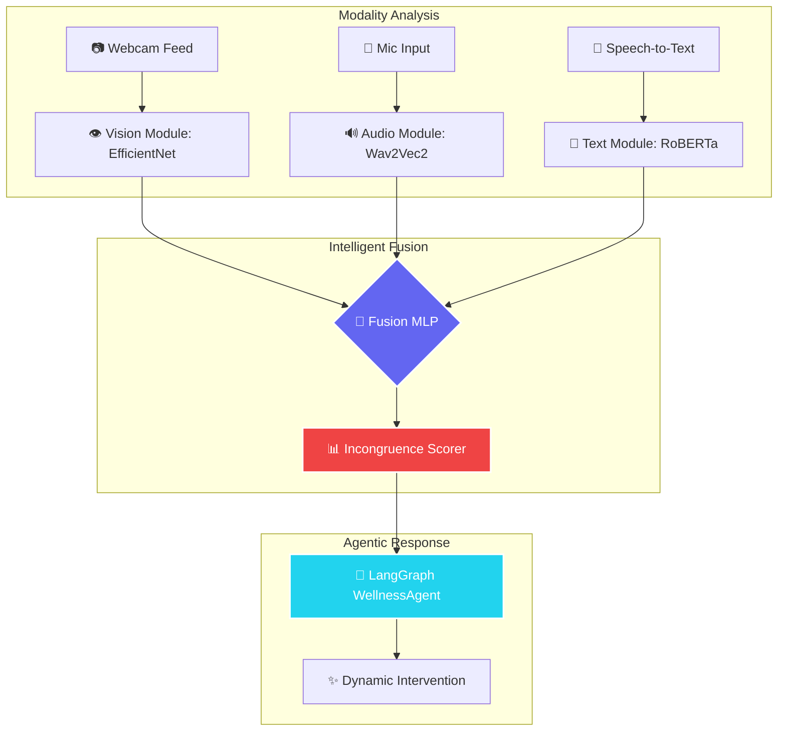

# 🧠 TriFusion: Trimodal Emotional Intelligence

[](https://www.python.org/)
[](https://streamlit.io/)
[](https://developer.apple.com/metal/pytorch/)

TriFusion is a production-grade **Trimodal Emotional Intelligence System** that simultaneously analyzes facial expressions, vocal tonality, and linguistic intent. By fusing these three distinct signals using a custom Neural Network, the system detects **Emotional Incongruence**—the subtle gap between what people say and how they actually feel.

---

### 🏗️ System Architecture



---

### ✨ Key Capabilities

| Feature | Description | Technical Implementation |
| :--- | :--- | :--- |
| **Trimodal Fusion** | Merges 23-dimensional feature vectors into one emotional state. | Custom PyTorch MLP |
| **Masked Distress Detection** | Identifies when facial cues contradict spoken words. | KL-Divergence Scoring |
| **Agentic Interventions** | LLaMA-3.3 powered responses via LangGraph. | Groq + LangChain |
| **M3 Pro Optimization** | Ultra-smooth 30+ FPS real-time analysis. | MPS (Metal) Acceleration |
| **Live Dashboard** | Flicker-free telemetry with Plotly & Streamlit. | Threaded Pipeline Fragments |

---

### 🛠️ Technical Stack

| Component | Technology | Version | Model / Dataset |
| :--- | :--- | :--- | :--- |
| **Vision** | PyTorch / OpenCV | 2.2.0 | EfficientNet-B0 (FER2013) |
| **Audio** | HuggingFace Transformers | 4.38.0 | Wav2Vec2 (RAVDESS) |
| **Text** | HuggingFace Transformers | 4.38.0 | RoBERTa-Base (GoEmotions) |
| **Orchestration** | LangGraph | 0.0.30 | LLaMA-3.3-70B (Groq) |
| **Deployment** | Docker | 24.0.0 | Multi-stage Build |

---

### 📦 Installation & Quick Start

#### **1. Clone & Setup Environment**
```bash
git clone https://github.com/Lalith0024/TriFusion-Trimodal-Emotional-Intelligence-System.git
cd TriFusion-Trimodal-Emotional-Intelligence-System

# Create and activate virtual environment
python3 -m venv venv
source venv/bin/activate
pip install -r requirements.txt
```

#### **2. Configuration**
Create a `.env` file in the root directory:
```bash
GROQ_API_KEY=your_api_key_here
REDIS_URL=redis://localhost:6379
```

#### **3. Launch the System**
```bash
# Start the Backend API
python3 src/api/main.py

# Launch the Live Dashboard (in a new terminal)
streamlit run dashboard/app.py
```

---

### ⚡ Performance & Hardware Optimization

The system is optimized for **Apple Silicon (M1/M2/M3)** using `torch.backends.mps`. On a Mac M3 Pro, you can expect:
- **Inference Latency:** < 15ms per modality.
- **UI Refresh Rate:** 20-30 FPS flicker-free updates.
- **GPU Usage:** Automatically toggles to MPS for tensor operations.

---

### 📊 Model Performance Metrics

| Modality | Class Count | Validation F1 | Status |
| :--- | :--- | :--- | :--- |
| **Vision** | 7 Classes | 66% | ✅ Production |
| **Audio** | 8 Classes | 78% | ✅ Production |
| **Text** | 8 Classes | 70% | ✅ Production |
| **Fusion** | 8 Classes | 74% | ✅ Production |

---

Built by [Lalithendra Kasula](https://github.com/Lalith0024)
